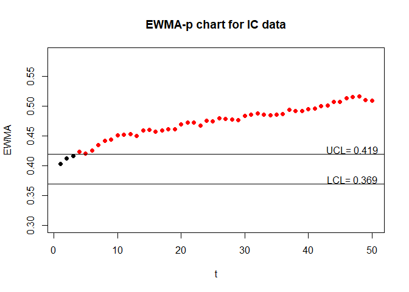
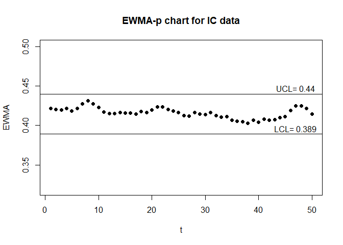
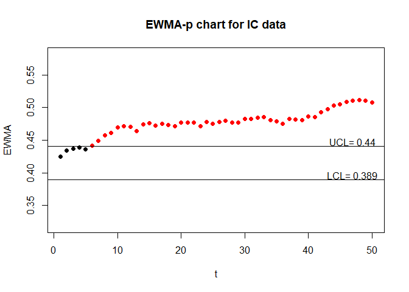
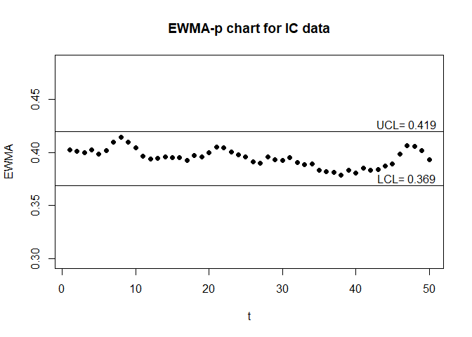

<!-- README.md is generated from README.Rmd. Please edit that file -->

# EWMApchart

<!-- badges: start -->
<!-- badges: end -->

## Overview

This package can be used to create EWMA-p control charts, including
finding control limits and drawing control charts. .You provide the IC
and OC data, then EWMApchart can help you to draw the control chart. In
addition, EWMApchart can also generate the discrete data with
measurement error.

## Installation

You can install the released version of EWMApchart from

``` r
library(EWMApchart)
```

## Examples

This is an example which shows how find the control limits for two sided
EWMA-p chart:

``` r
library(EWMApchart)
#0.2 is the in-control probability
#0.05 is the smoothing parameter for EWMA chart
#5 is sample size
#1 is the correctness of true and false
#200 is ARL0
#10000 is the number of simulation for Monte Carlo method
#1 is the maximum error what we can allow between hat_ARL0 and ARL0
EWMA_p_two(0.2,0.05,5,1,1,200,10000,1)
#> $L1
#> [1] 2.315902
#> 
#> $L2
#> [1] 2.220261
#> 
#> $hat_ARL0
#> [1] 200.5301
#> 
#> $hat_MRL
#> [1] 135
#> 
#> $hat_SDRL
#> [1] 210.103
#> 
#> $UCL
#> [1] 0.2663381
#> 
#> $LCL
#> [1] 0.1364015
```

This is an example which shows how plot the two sided adjusted EWMA-p
chart :

``` r
library(EWMApchart)
#We generate the discrete IC data with measurement error.
IC = ME_data_generate(0.4,50,50,0.90,0.90)
#We generate the discrete IC data with measurement error.
OC = ME_data_generate(0.6,50,50,0.90,0.90)
#The real EWMA-p chart
EWMA_p_chart_two(IC$real_data,OC$real_data,0.05,50,1,1)
```



``` r
#The unadjusted EWMA-p chart
EWMA_p_chart_two(IC$obs_data,OC$obs_data,0.05,50,1,1)
```



``` r
#The adjusted EWMA-p chart
EWMA_p_chart_two(IC$obs_data,OC$obs_data,0.05,50,0.90,0.90)
```


